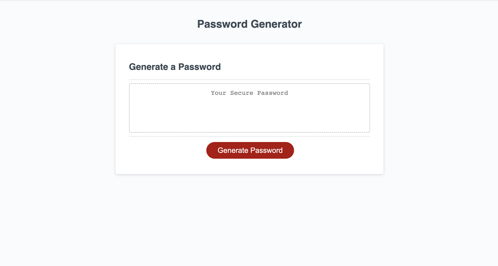

# password-generator

In this project, I worked in the JavaScript file to create an application that generates a random password based on user input. I completed the following:

1. When the user clicks the "Generate Password" button, they are brought through a sequence of questions, beginning with a prompt.
2. The first prompt asks the user to select their password length between 8 and 128 characters.
3. Next, is a sequence of confirm() methods which display questions regarding if the user would like to include lowercase, uppercase, numeric and/or special characters in their password. The user can click "OK" or "Cancel" on each of these statements.
4. Following the prompts, the user is presented with their randomly generated password, based on their input, on the page.

## Link:

[https://hollyhleal.github.io/password-generator/](https://hollyhleal.github.io/password-generator/)

## Screenshot:

